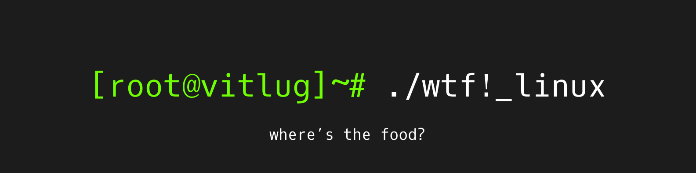

```
$ sudo systemctl start wtf!_linux-daemon
```
Service wtf!_linux-daemon successfully started!

```
$ wtf!_linux --start
```
Welcome to wtf!_linux, a game where you delve into the fundamentals and far corners of Linux to be one of the champions of VITLUG.
```
$ wtf!_linux --register
```
To register, fork this repository, and add a new file with your team name in this format - 

```teamname.txt```

and add your team name, team member names, and roll numbers to the file, separated by a comma, in the format - 

John Doe, 20XXX0000

Commit this file, and make a pull request. 

```
$ wtf!_linux --rules
```
There will be 6 rounds in this contest, the first round being a quiz, and the rest being rounds where you code. <br>
You will battle it out against each other over super-interesting Linux riddles and kernel hackery, to proceed to the forthcoming rounds.<br>
There will be a bonus round with a surprise as well :)


